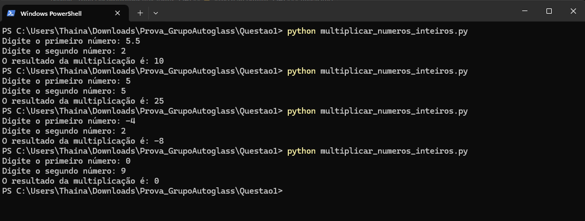
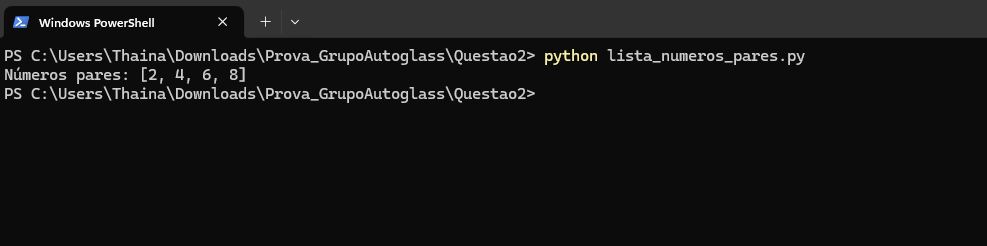
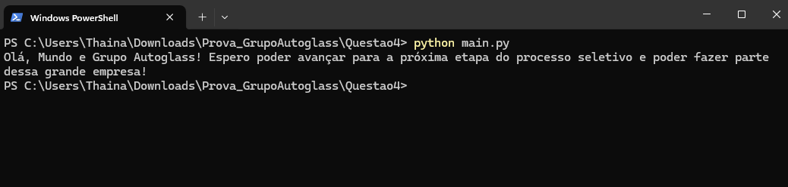

# Prova Python - Vaga Desenvolvedor RPA Júnior


## Índice
- <a href="#descricao">Descrição</a>
- <a href="#funcionalidades">Funcionalidades</a>
- <a href="#demonstracao">Demonstração das Questões</a>
- <a href="#acesso">Acesso ao Projeto</a>
- <a href="#tecnologias">Tecnologias Utilizadas</a>
- <a href="#autores">Pessoas Autoras</a>

## 📄Descrição 
Prova composta por 4 questões, sendo as duas primeiras a criação de dois scripts, a terceira sendo a explicação de um script, e a quarta sendo a explicação de um diretório e criação de um pequeno script, todos em Python.

### Questão 1: Multiplicar números inteiros
Escreva um programa contendo uma função que tenha como parâmetros de entrada dois números inteiros.
- A função deve executar a multiplicação dos dois números.
- A função deve ter type hints nas variáveis de entrada e no retorno.
- A função deve converter os números em inteiros caso não sejam.
- A função deve ter tratativa de erros caso os parâmetros não sejam números.
- A função deve retornar o resultado.
- Use if __name__ == "__main__" para executar a função.

### Questão 2: Lista de números pares
Escreva um programa contendo uma função que receba uma lista de inteiros. 
Exemplo de entrada da função: [1, 2, 3, 4, 5, 6, 7, 8]
- A função deve mostrar todos os números pares da lista.
- A função deve ter type hints nas variáveis de entrada.
- A função deve ter tratativa de erros caso o valor nao seja um número inteiro.
- Use if __name__ == "__main__" para executar a função.

### Questão 3: Explicar um código em Python
```bash
#Explique o código abaixo.
01 import requests
02 import json
03 
04 url = 'https://api.github.com/some/endpoint'
05 
06 headers = {‘header’: ‘header1’}
07 payload = {data: 'data1'}
08
09 resp = requests.post(url, data=json.dumps(payload), headers=headers)
10
11 if resp.status_code == 200:
12 resp = json.loads(resp.content)
13 print(resp.content)
```

### Questão 4: Explicar a estrutura de um diretório e criar um código que demonstre como importar uma função de outro arquivo
Analise a estrutura de diretórios abaixo e explique sobre cada pasta/arquivo apresentado, e implemente um código simples com os seguintes passos:
- A partir do main.py realizar a chamada de uma função ‘ola_mundo()’ presente no arquivo src/ola_mundo.py que deve retornar uma string com uma mensagem qualquer.
- Utilizar o if __name__ == "__main__" para executar a função.
- Demonstrar como importar a função de outro arquivo.

```bash
#Estrutura de diretórios:
| .venv
| assets
| src/
 __init__.py
 ola_mundo.py
| logs/
 logs.log
| main.py
| .gitignore
| requirements.txt
| README.md
```

## ✔️Funcionalidades
### Questão 1: Multiplicar números inteiros
- [x] Cria função para converter valores para inteiro usando type hints;
- [x] # Verifica se o valor é float (decimal) para converter em inteiro;
- [x] Converte o valor para inteiro após verificação;
- [x] Insere mensagem de erro e encerra a aplicação caso gere uma exceção;
- [x] Cria função para multiplicar os números inteiros usando type hints;
- [x] Garante que os dois números sejam inteiros usando a função de conversão como validação;
- [x] Realiza a multiplicação dos números;
- [x] Executa a função se o arquivo for rodado diretamente;
- [x] Inserindo os números que devem ser multiplicados;
- [x] Chama a função de multiplicação e exibe o resultado;
- [x] Insere mensagem de erro e encerra a aplicação caso gere uma exceção;

### Questão 2: Lista de números pares
- [x] Importa uma lista;
- [x] Cria função para encontrar os números pares da lista;
- [x] Verifica se todos os elementos da lista são inteiros;
- [x] Insere mensagem de erro e encerra a aplicação caso gere uma exceção;
- [x] Faz cálculo e exibe os números pares da lista;
- [x] Insere mensagem de erro e encerra a aplicação caso gere uma exceção;
- [x] Executa a função se o arquivo for rodado diretamente;
- [x] Insere o exemplo de lista de entrada;
- [x] Chama a função para retornar os números pares;

### Questão 3: Explicar um código em Python
A explicação do código está na pasta "Questao3" dentro arquivo "explicacao_codigo.py". Onde é possível verificar a descrição do código linha por linha.

### Questão 4: Explicar a estrutura de um diretório e criar um código que demonstre como importar uma função de outro arquivo
A explicação do diretório está na pasta "Questao4" dentro do arquivo "explicacao-diretorio.py". Onde é possível verificar a descrição das pastas e arquivos um por um.

Funcionalidades do código de importação de função:
- [x] Criação da pasta "src" dentro da pasta "Questão4";
- [x] Dentro da pasta "src" foi criado o arquivo "ola_mundo.py"
- [x] Dentro do arquivo "ola_mundo.py", contém a função "ola_mundo" onde é informado uma mensagem;
- [x] Criação do arquivo main.py dentro da pasta "Questao4";
- [x] Dentro do arquivo "main.py" encontra-se a importação da função ola_mundo do módulo src.ola_mundo;
- [x] Em seguida, executa a função se o arquivo for rodado diretamente;
- [x] Chama a função ola_mundo() em uma variável;
- [x] Exibe a mensagem retornada pela variável;

## 💻Demonstração das Questões
### Questão 1: Multiplicar números inteiros

Console com exemplos de testes do script 

### Questão 2: Lista de números pares

Console com retorno do script 

### Questão 3: Explicar um código em Python
Por não ser um arquivo executável, abra o mesmo através da pasta "Questao3" acessando o arquivo "explicacao_codigo.py".

### Questão 4: Explicar a estrutura de um diretório e criar um código que demonstre como importar uma função de outro arquivo
A primeira parte da pergunta não se trata de um arquivo executável, por conta disso, abra o mesmo através da pasta "Questao4" acessando o arquivo "explicacao_diretorio.py"


Console retornando informação na segunda etapa da questão

## 🔓Acesso ao Projeto
### Requisitos:
- Python 3.x (caso não tenha, baixe a versão mais recente em: https://www.python.org/)
- Git (caso não tenha, baixe a versão mais recente em: https://git-scm.com/downloads)

```bash
# Clone este repositório na pasta que desejar através do Git Bash
$ git clone https://github.com/ThainaSilva100/Prova_GrupoAutoglass.git

# Acesse a pasta do projeto no seu terminal
$ cd Prova_GrupoAutoglass

# Por ordem das questões, execute os arquivos:
# Questão 1
$ cd Questao1
$ python multiplicar_numeros_inteiros.py

# Questão 2
$ cd Questao2
$ python lista_numeros_pares.py

# Questão 4
$ cd Questao4
$ python main.py
```
Para sair de uma pasta e entrar em outra faça os comandos abaixo (repetir até passar por todas as questões):

```bash
# Volta para a pasta principal do projeto
$ cd..

# Entra em outra pasta/próxima questão
$ cd Questao2
```
No tópico __Demonstração da Aplicação__ é possível verificar como executar através dos prints.

## ⚙️Tecnologias Utilizadas
1. [Python](https://www.python.org/)

## 🙂Pessoas Autoras


[LinkedIn](https://www.linkedin.com/in/thaina-silva-655302178/) 